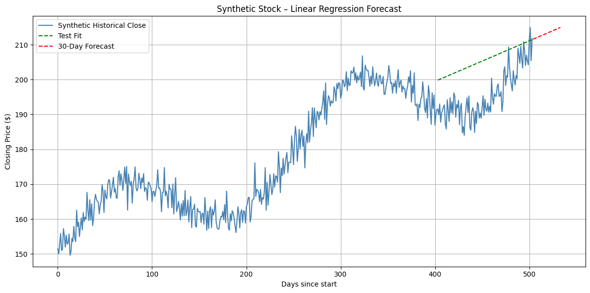

# Stock Price Prediction

A simple Python project to predict stock prices using Linear Regression on historical data.

## Features
- Fetches real-time historical stock data (e.g., AAPL).
- Visualizes closing prices.
- Trains a basic Linear Regression model to forecast the next 30 days.

## Setup
1. Clone the repo: `git clone https://github.com/pavithradevi3009/stock_price_prediction.git`
2. Install dependencies: `pip install -r requirements.txt`
3. Run: `python stock_predictor.py`

## Usage
Edit the `stock_symbol` in `stock_predictor.py` to change the stock (e.g., 'GOOGL' for Google).

##  Output
The script prints predictions and shows a plot.

## Libraries Used
- yfinance: Data fetching
- pandas, numpy: Data handling
- matplotlib: Visualization
- scikit-learn: Modeling
